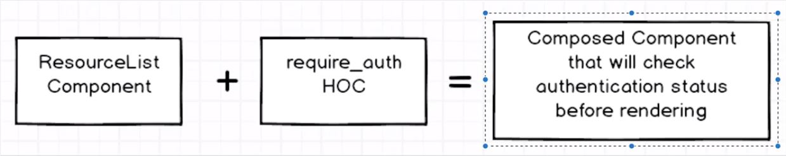

# Higher Order Components

## Getting Started

Checkout this repo, install dependencies, then start the gulp process with the following:

```shell
> git clone https://github.com/CodeSchwert/higher-order-components.git
> cd higher-order-components
> npm install
> npm start
```

Open a browser and navigate to `localhost:8080` to view the app.

## What's Going On!?

The `/Resources` link is protected via the `Authentication` Higher Order Component (HOC). Users will need to click the `Sign In` button to simulate signing into the page before they can access the `Resources` component.


